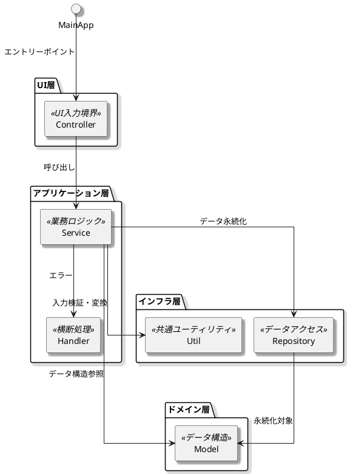

# クラス設計

## クラス一覧

|論理名|物理名|概要|
|---|---|---|
|UI入力境界|Controller|ユーザー操作やUI入力（ボタン、テキスト、ドロップダウンなど）を受け取り、対応するServiceへ処理を委譲する。自身は業務ロジックを持たない。|
|業務ロジック|Service|ビジネスルールに基づく内部処理を担当。Controllerからの要求に応じてRepositoryやUtilを呼び出し、処理結果を返却する。|
|横断機能|Handler|共通的・横断的な処理（例外通知、ログ記録、エラーハンドリングなど）を担当。ServiceやControllerから呼び出される。|
|データアクセス|Repository|データの永続化および取得を担当。CSV、JSON、外部APIなどのI/Oを抽象化し、アプリケーションロジックから切り離す。|
|共通機能|Util|純粋関数や副作用のない共通ロジックを提供。形式変換、入力検証、フォーマット処理などを集約する。|
|データ構造|Model|アプリケーション内で扱うデータの構造（属性・型定義）を保持。ServiceやRepository間でのデータ受け渡しに利用される。|

## 関係図
