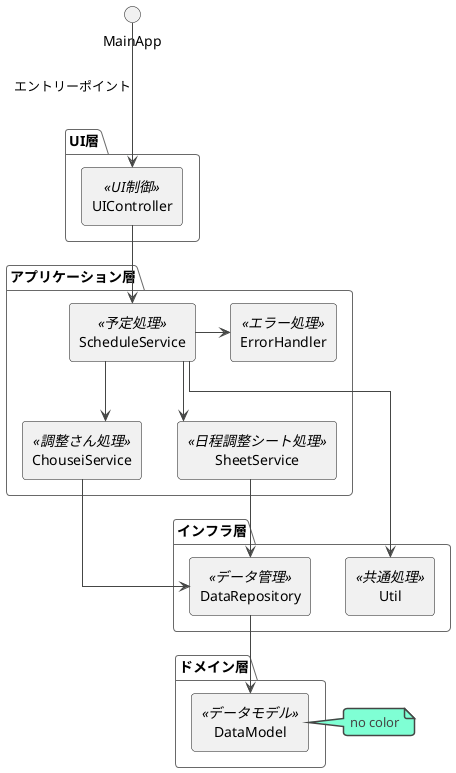

# クラス一覧

|論理名|物理名|説明|
|---|---|---|
|エントリーポイント|MainApp|エントリーポイント|
|UI制御|UIController|UIの入力と更新、表示を担当|
|予定処理|ScheduleService|予定データの処理用、予定一覧、予約一覧、ブッキングチェックなどを担当|
|調整さん処理|ChouseiService|調整さんのデータの取得や整形の処理を担当|
|日程調整シート処理|SheetService|日程調整シートの取得や整形の処理を担当|
|データアクセス|DataRepository|データの読み込み、保存を担当|
|データモデル|DataModel|データモデルを担当|
|エラー処理|ErrorHandler|エラー処理などを担当|
|共通処理|Util|共通処理を担当|

# コンポーネント図

