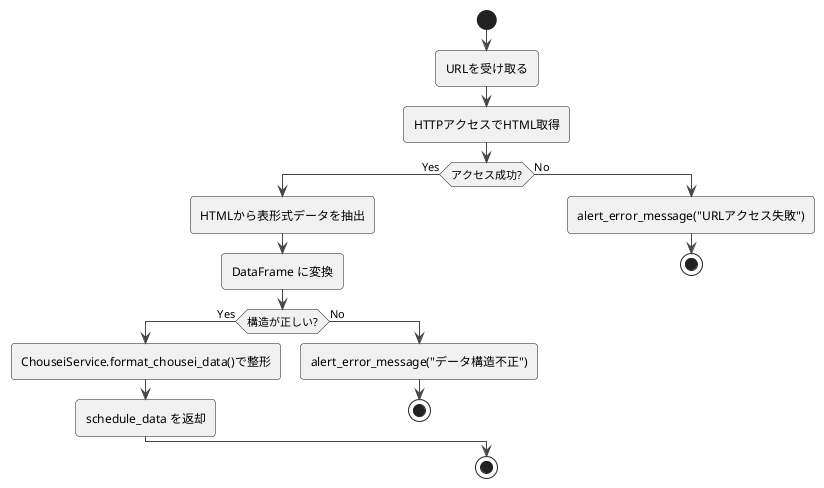

# 4-1. scrape_chousei_data

##### 目的
- 調整さんのイベントページから回答データをスクレイピングし、予定データとして取得する。  
- 入力URLをもとにHTMLを解析し、参加者名・日付・回答記号を抽出して整形する。  

##### 引数
- `url: str`

##### 戻り値
- `schedule_data: DataFrame`

##### 呼出先
- `ErrorHandler.alert_error_message`  
- `ChouseiService.format_chousei_data`

##### 処理手順
1. 引数`url`を受け取る。  
2. 指定されたURLにHTTPアクセスを行い、HTMLを取得する。  
　- 接続タイムアウトまたはHTTPエラー時はエラーメッセージを返して終了。  
3. 取得したHTMLを解析し、表形式データ（日時・ユーザー名・回答記号）を抽出する。  
4. 抽出データをDataFrame形式に変換し、構造の正当性を検証する。  
　- 列欠落または不正フォーマットの場合はアラートを出力して終了。  
5. 正常に解析できた場合、`ChouseiService.format_chousei_data()`で整形し、`schedule_data`を返却する。  

##### 異常系
- URLが無効またはアクセス不可 → エラーメッセージを返して終了。  
- HTML構造が変化し解析失敗 → エラーメッセージを返して終了。  
- 必須列（日時・ユーザー名・回答記号）が欠落 → エラーメッセージを返して終了。  

##### テスト観点
- 正常系  
  - [ ] 正常な調整さんURLからデータが取得・整形される。  
  - [ ] 取得結果の列構造（日時・ユーザー名・回答記号）が正しい。  
  - [ ] 正常にDataFrameへ変換される。  
- 異常系  
  - [ ] 無効URL時に適切なエラーメッセージが返る。  
  - [ ] HTML構造変化時に例外が発生し、アラートが通知される。  
  - [ ] 必須列が欠落している場合にエラーメッセージが返る。  
- 性能系  
  - [ ] イベントの参加者数が多くても（例: 100人超）処理が完了する。  

##### 処理図
