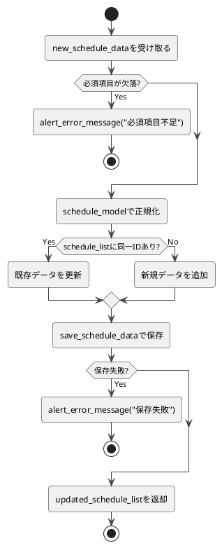

# 3-2. update_schedule_list

##### 目的  
- 新規追加または更新処理を自動判定で実行する。  
- 予定データの存在有無に応じて動的に処理を分岐する。  
- 処理を共通化し、呼び出し側でモード指定を不要とする。  

##### 引数  
- `schedule_list: DataFrame`  
- `schedule_data: Dict`  

##### 戻り値  
- `updated_schedule_list: DataFrame`  

##### 呼出先  
- `DataRepository.save_schedule_data`  
- `ErrorHandler.alert_error_message`  
- `DataModel.schedule_model`  

##### 処理手順  
1. 引数`schedule_list`と`schedule_data`を受け取る。  
2. `schedule_data`の必須項目を検証する。  
　- 欠落している場合はエラーメッセージを返して処理終了。  
3. `schedule_list`内に同一IDのデータが存在するか確認する。  
　- 存在する場合 → 更新モードとして処理。  
　- 存在しない場合 → 新規追加モードとして処理。  
4. `schedule_model`でデータを正規化する。  
5. 判定結果に応じて以下の処理を行う。  
　- 既存データあり：対象データを更新。  
　- 既存データなし：新規データを追加。  
6. `save_schedule_data`で永続化を行う。  
　- 保存処理が失敗した場合はエラーメッセージを返して終了。  
7. 更新済み`schedule_list`を返却し、UIへ反映する。  

##### 異常系  
- 必須項目欠落 → エラーメッセージを返して終了  
- 永続化失敗 → エラーメッセージを返して終了  

##### テスト観点  
- 正常系  
  - [ ] 新規データが存在しない場合に追加される  
  - [ ] 既存データが存在する場合に更新される  
  - [ ] 保存後にUIへ正しく反映される  
- 異常系  
  - [ ] 必須項目が欠落している場合にエラーメッセージが返る  
  - [ ] 保存処理が失敗した場合にエラーメッセージが返る  
- 性能系  
  - [ ] データ件数が0件/1件/大量でも処理が正しく行われる  

##### 処理図  
