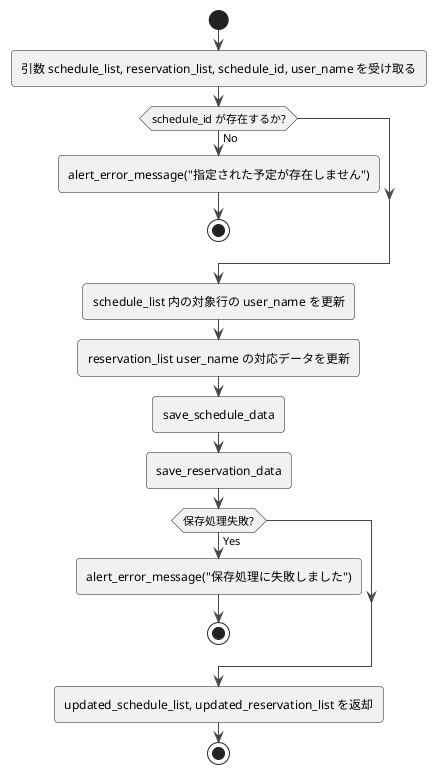

# 3-3. update_user_name

##### 目的
- 指定された`schedule_id`に対応する予定データおよび予約データのユーザー名を更新する。  
- 予定一覧と予約一覧の整合性を保ちながらユーザー名変更を反映する。  

##### 引数
- `schedule_list: DataFrame`  
- `reservation_list: DataFrame`  
- `schedule_id: str`  
- `user_name: str`  

##### 戻り値
- `updated_schedule_list: DataFrame`  
- `updated_reservation_list: DataFrame`  

##### 呼出先
- `DataRepository.save_schedule_data`  
- `DataRepository.save_reservation_data`  
- `ErrorHandler.alert_error_message`  

##### 処理手順
1. 引数`schedule_list`、`reservation_list`、`schedule_id`、`user_name`を受け取る。  
2. `schedule_list`内に`schedule_id`が存在するかを検証する。  
   - 存在しない場合はエラーメッセージを表示し処理を終了する。  
3. `schedule_list`内の該当する`schedule_id`行の`user_name`を更新する。  
4. `reservation_list`内で`schedule_id`のuser_nameに対応する予約データを検索し回答記号を更新する。
5. 更新後の`schedule_list`および`reservation_list`を保存する。  
6. 更新結果として`schedule_list`と`reservation_list`を返却する。  

##### 異常系
- 指定された`schedule_id`が存在しない → エラーメッセージを返して終了  
- データ保存処理に失敗 → エラーメッセージを返して終了  

##### テスト観点
- 正常系  
  - [ ] 指定された`schedule_id`の`user_name`が`schedule_list`で正しく更新される  
  - [ ] 該当する`reservation_list`の`user_name`も同時に更新される  
  - [ ] 更新後のデータが正しく保存される  
- 異常系  
  - [ ] 存在しない`schedule_id`を指定した場合にエラーメッセージが返る  
  - [ ] 保存処理が失敗した場合にエラーメッセージが返る  
- 性能系  
  - [ ] データ件数が0件/1件/大量でも処理が正しく行われる  

##### 処理図
