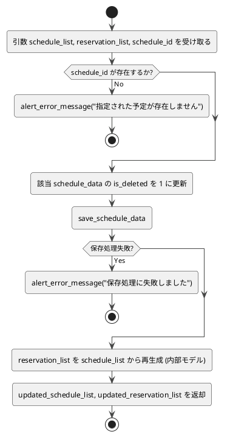

# 3-4. delete_schedule_data

##### 目的
- 指定された予定データの削除フラグ（`is_deleted`）を更新する。  
- 本システムでは削除フラグによって予定データの活性・非活性を管理する。  
- `reservation_list`は永続化せず、常に`schedule_list`から内部生成される一時データとして扱う。  

##### 引数
- `schedule_list: DataFrame`  
- `reservation_list: DataFrame`（※内部モデル、一時生成）  
- `schedule_id: str`  

##### 戻り値
- `updated_schedule_list: DataFrame`  
- `updated_reservation_list: DataFrame`  

##### 呼出先
- `DataRepository.save_schedule_data`  
- `ErrorHandler.alert_error_message`  

##### 処理手順
1. 引数`schedule_list`、`reservation_list`、`schedule_id`を受け取る。  
2. `schedule_list`内に指定された`schedule_id`が存在するかを検証する。  
　- 存在しない場合 → エラーメッセージを返して処理終了。  
3. 該当する予定データの削除フラグ（`is_deleted`）を`1`に更新する。  
4. 更新後の`schedule_list`を`save_schedule_data()`で永続化する。  
　- 保存処理が失敗した場合 → エラーメッセージを返して処理終了。  
5. 更新済み`schedule_list`を基に、`reservation_list`を再生成する。  
　- `reservation_list`は`schedule_list`から内部的に再構築されるため、永続化は行わない。  
6. 更新済みの`schedule_list`と再生成された`reservation_list`を返却し、UIを更新する。  

##### 異常系
- 指定された`schedule_id`が存在しない場合 → エラーメッセージを返して終了。  
- 永続化処理に失敗した場合 → エラーメッセージを返して終了。  

##### テスト観点
- 正常系  
  - [ ] 指定した`schedule_id`の削除フラグが`1`に正しく更新される。  
  - [ ] `reservation_list`が`schedule_list`から正しく再生成される。  
  - [ ] 更新後の`schedule_list`が永続化され、UIに反映される。  
- 異常系  
  - [ ] 存在しない`schedule_id`を指定した場合にエラーメッセージが返る。  
  - [ ] 永続化処理が失敗した場合にエラーメッセージが返る。  
- 性能系  
  - [ ] データ件数が0件/1件/大量でも処理が正しく行われる。  

##### 処理図
