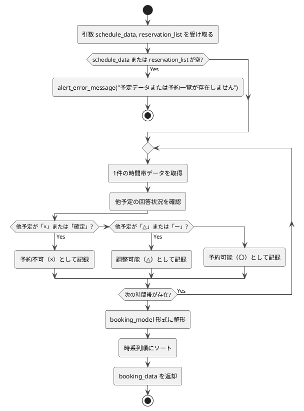

# 3-6. check_booking

##### 目的
- 予定データ（`schedule_data`）と予約一覧データ（`reservation_list`）を比較し、各時間帯の予約可否を判別する。  
- 各ユーザーの回答状況をもとに、重複予定や確定済み予定を考慮して、予約可能・調整可能・不可の状態を算出する。  
!!! info 
    「日程調整シート」のみ予定が「確定」となる場合がある。  
    「確定」状態の予定は他予定の可否判定において「×（予約不可）」として扱う。  

##### 引数
- `schedule_data: DataFrame`  
- `reservation_list: DataFrame`  

##### 戻り値
- `booking_data: DataFrame`  

##### 呼出先
- `ErrorHandler.alert_error_message`  
- `BookingModel.format_booking_result`（予約可否データ整形処理）  

##### 処理手順
1. 引数`schedule_data`および`reservation_list`を受け取る。  
2. データの整合性を検証する。  
　- `schedule_data`または`reservation_list`が空の場合 → エラーメッセージを返して処理終了。  
3. 各時間帯について以下のロジックで予約可否を判定する。  
　- 他予定が「×」または「確定」の場合 → 予約不可（×）  
　- 他予定が「△」または「ー」の場合 → 調整可能（△）  
　- 他予定が存在しない場合 → 予約可能（〇）  
4. 判定結果を`booking_model`形式に整形し、時系列順にソートする。  
5. 整形済みの`booking_data`を返却する。  

##### 異常系
- `schedule_data`または`reservation_list`が空の場合 → エラーメッセージを返して終了。  
- 判定処理中に例外発生 → `alert_error_message()`で通知し処理を中断。  

##### テスト観点
- 正常系  
  - [ ] 他予定が「×」または「確定」の場合、予約不可（×）と判定される。  
  - [ ] 他予定が「△」「ー」の場合、調整可能（△）と判定される。  
  - [ ] 他予定が存在しない場合、予約可能（〇）と判定される。  
  - [ ] 判定結果が時系列順に整形される。  
- 異常系  
  - [ ] `schedule_data`または`reservation_list`が空の場合にエラーメッセージが返る。  
  - [ ] 整形処理中に例外発生時、処理が中断しエラー通知される。  
- 性能系  
  - [ ] データ件数が0件/1件/大量でも処理が正しく完了する。  

##### 処理図
