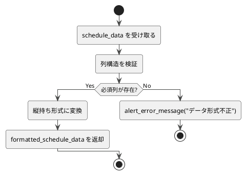

# 4-2. format_chousei_data

##### 目的
- 調整さんから取得した表形式データを、内部処理向けの縦持ち形式（event × user × datetime × response）に整形する。  
- 後続処理（予約判定・日程整形など）で扱いやすいデータ構造に変換する。  

##### 引数
- `schedule_data: DataFrame`

##### 戻り値
- `formatted_schedule_data: DataFrame`

##### 呼出先
- `ErrorHandler.alert_error_message`

##### 処理手順
1. 引数`schedule_data`を受け取る。  
2. 列構造を検証する（ユーザー名・日時・回答記号の列が存在するか確認）。  
　- 欠落している場合はエラーメッセージを返して終了。  
3. DataFrameを「日時」を基準に縦持ち形式へ変換する。  
　- 各行が `(event_name, user_name, datetime, response)` の形式になるように整形する。  
4. 整形後の`formatted_schedule_data`を返却する。  

##### 異常系
- 必須列が存在しない → エラーメッセージを返して終了。  
- データ変換処理中に例外発生 → `alert_error_message()`で通知して終了。  

##### テスト観点
- 正常系  
  - [ ] 正常な表形式データが正しく縦持ち形式に変換される。  
- 異常系  
  - [ ] 列構造が不正な場合、エラーメッセージが返る。  
  - [ ] 変換途中に例外が発生した場合、アラートが通知される。  
- 性能系  
  - [ ] 大量データ（例: 1万件以上）でも処理が一定時間内に完了する。  

##### 処理図
