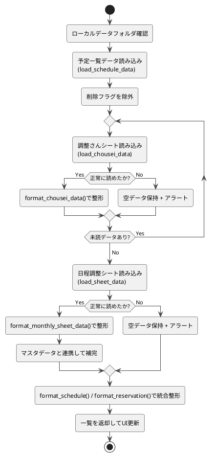

# 3-1. init_schedule_data

##### 目的
- アプリ起動時に予定一覧・予約一覧を初期化する。  
- 既存のCSVを読み込み、存在しない場合は空構造を生成する。  

##### 引数
- なし  

##### 戻り値  
- `schedule_list: List`  
- `reservation_list: List`  

##### 呼出先  
- `DataRepository.load_schedule_data`  
- `DataRepository.load_chousei_data`  
- `DataRepository.load_sheet_data`  
- `DataRepository.load_sheet_master_data`
- `ChouseiService.format_chousei_data`  
- `SheetService.format_monthly_sheet_data`  
- `ScheduleService.format_schedule`  
- `ScheduleService.format_reservation`
- `ErrorHandler.alert_error_message`

##### 処理手順  
1. ローカルデータフォルダを確認する。  
2. `load_schedule_data()`で予定一覧データを読み込む。  
   - 削除フラグがない予定データに限定する。  
3. `load_chousei_data()`で調整さんシートをすべて読み込む。  
   - 存在しない場合 → 空データを保持してスキップ、アラート。  
   - 破損している場合 → 空リストを保持してスキップ、アラート。  
   - 正常に読めた場合 → `format_chousei_data()`で整形。  
4. `load_sheet_data()`で日程調整シートデータを読み込む。  
   - 存在しない場合 → 空データを保持してスキップ、アラート。  
   - 破損している場合 → 空リストを保持してスキップ、アラート。  
   - 正常に読めた場合 → `format_monthly_sheet_data()`で整形。  
     - `load_sheet_master_data()`でマスタデータを読み込み、会議名とユーザー名を補完して整形。  
5. 取得データをそれぞれ`format_schedule()` / `format_reservation()`で整形する。  
6. 整形後の一覧をディクショナリとして返却し、UIを更新する。  

##### 異常系  
- CSVが存在しない場合：空リストを返却する。  
- ファイルが破損している場合：`alert_error_message()`で通知する。  

##### テスト観点  
- 正常系  
  - [ ] 既存CSVが正しく読み込まれ、UIに一覧表示される  
- 異常系  
  - [ ] データが存在しない場合、アプリが起動し空リストを返す  
  - [ ] データが破損している場合、アラートを表示し処理を継続できる  
- 性能系  
  - [ ] データ件数が0件/1件/大量でも処理が正しく行われる  

##### 処理図  
