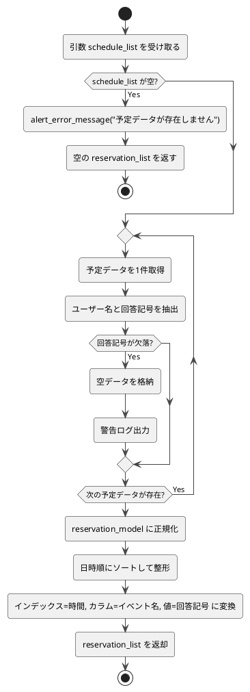

# 3-5. format_reservation

##### 目的
- 予定一覧（`schedule_list`）を基に予約一覧（`reservation_list`）を整形する。  
- 各ユーザーの回答記号を時系列に並べ替え、UI表示用の構造に変換する。  

##### 引数
- `schedule_list: DataFrame`  

##### 戻り値
- `reservation_list: DataFrame`  

##### 呼出先
- `ErrorHandler.alert_error_message`  
- `DataModel.reservation_model`（整形用モデル定義が存在する場合）  

##### 処理手順
1. 引数`schedule_list`を受け取る。  
2. `schedule_list`が空でないか検証する。  
　- 空の場合 → 空の`reservation_list`を返却して終了。  
3. `schedule_list`をループし、予定データごとに以下の処理を行う。  
　- 各予定のユーザー名と回答記号（○/△/×/ー）を抽出。  
　- 該当ユーザーの回答が存在しない場合 → 空データ（または`ー`）を格納。  
　- 該当データが破損・不正な場合 → 警告ログを出力しスキップ。  
4. 取得した全ユーザーの回答記号を`reservation_model`形式に整形する。  
5. 日付・時刻をキーとしてソートし、  
　インデックス＝時間、カラム＝イベント名、セル＝回答記号の形式に変換する。  
6. 生成された`reservation_list`を返却する。  

##### 異常系
- `schedule_list`が空の場合 → 空のDataFrameを返却し警告を出力。  
- 回答記号またはユーザー名が欠落している場合 → 空データを格納して継続処理。  
- 整形処理中に例外発生 → `alert_error_message()`で通知し処理を中断。  

##### テスト観点
- 正常系  
  - [ ] 全ユーザーの回答記号が正しく整列され、`reservation_list`が生成される。  
  - [ ] 回答欠落時に空欄（または`ー`）が格納される。  
  - [ ] 時系列順に整形され、UI表示に適したDataFrame形式となる。  
- 異常系  
  - [ ] `schedule_list`が空の場合、空DataFrameが返る。  
  - [ ] 欠損データがある場合に警告が出力される。  
  - [ ] 整形中に例外が発生した場合、エラーメッセージが返る。  
- 性能系  
  - [ ] データ件数が0件/1件/大量でも処理が正しく完了する。  

##### 処理図
